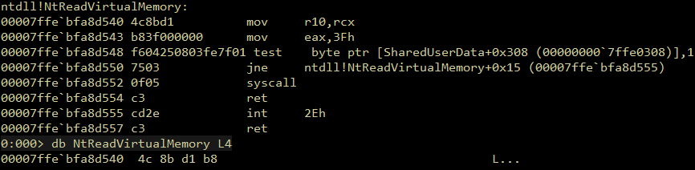

# Find-UserlandHooks
PowerShell script to find NTDLL functions that may be hooked by AV or EDR by comparing what exists on disk with the loaded ntdll module.


## Description
Antivirus and EDR solutions may detect some malicious behaviors by hooking Win32 API functions at the lowest level of user mode since Kernel Patch Protection prohibits patching functions at the kernel level. As these hooks typically place a 'jmp' instruction at the start of the function, we may detect these hooks by enumerating all functions and comparing the prologue with what exists in 'ntdll.dll' on disk.



## Usage
1. Import the module
```
PS> Import-Module .\Find-UserlandHooks.ps1
```
2. Run `Find-UserlandHooks`
- Get the hooked results of all Nt/Zw functions.
    ```
    PS> Find-UserlandHooks
    ```
- Only get Nt/Zw functions that are hooked and include the expected/actual prologues
    ```
    PS> Find-UserlandHooks -HookedOnly -ShowPrologues
    ```
- Get the hooked results of all functions in 'ntdll.dll'
    ```
    PS> Find-UserlandHooks -BeyondNtZwFunctions -ShowPrologues
    ```
- Searching for a specific function
    ```
    PS> $Results = Find-UserlandHooks
    PS> $Results | Where-Object Function -eq 'NtCreateProcess'
    ```
<details> <summary>Example output of hooked functions when EDR is present</summary>

```
Function                       Expected                 Actual                   Hooked
--------                       --------                 ------                   ------
NtAllocateVirtualMemory        {0x4C, 0x8B, 0xD1, 0xB8} {0xE9, 0x03, 0xA2, 0xFE}   True
NtCreateSymbolicLinkObject     {0x4C, 0x8B, 0xD1, 0xB8} {0xE9, 0xB3, 0x96, 0xFE}   True
NtCreateThreadEx               {0x4C, 0x8B, 0xD1, 0xB8} {0xE9, 0x13, 0x95, 0xFE}   True
NtCreateUserProcess            {0x4C, 0x8B, 0xD1, 0xB8} {0xE9, 0xF3, 0x94, 0xFE}   True
NtFreeVirtualMemory            {0x4C, 0x8B, 0xD1, 0xB8} {0xE9, 0xA3, 0xA1, 0xFE}   True
NtLoadDriver                   {0x4C, 0x8B, 0xD1, 0xB8} {0xE9, 0x93, 0x88, 0xFE}   True
NtMapUserPhysicalPages         {0x4C, 0x8B, 0xD1, 0xB8} {0xE9, 0x53, 0x8D, 0xFE}   True
NtMapViewOfSection             {0x4C, 0x8B, 0xD1, 0xB8} {0xE9, 0xC3, 0xA0, 0xFE}   True
NtOpenProcess                  {0x4C, 0x8B, 0xD1, 0xB8} {0xE9, 0x63, 0xA1, 0xFE}   True
NtProtectVirtualMemory         {0x4C, 0x8B, 0xD1, 0xB8} {0xE9, 0x43, 0x9D, 0xFE}   True
NtQuerySystemInformation       {0x4C, 0x8B, 0xD1, 0xB8} {0xE9, 0xC3, 0xA2, 0xFE}   True
NtQuerySystemInformationEx     {0x4C, 0x8B, 0xD1, 0xB8} {0xE9, 0x33, 0x80, 0xFE}   True
NtQueueApcThread               {0x4C, 0x8B, 0xD1, 0xB8} {0xE9, 0x63, 0xA2, 0xFE}   True
NtQueueApcThreadEx             {0x4C, 0x8B, 0xD1, 0xB8} {0xE9, 0x33, 0x81, 0xFE}   True
NtReadVirtualMemory            {0x4C, 0x8B, 0xD1, 0xB8} {0xE9, 0xC3, 0xA2, 0xFE}   True
NtResumeThread                 {0x4C, 0x8B, 0xD1, 0xB8} {0xE9, 0xC3, 0x9D, 0xFE}   True
NtSetContextThread             {0x4C, 0x8B, 0xD1, 0xB8} {0xE9, 0xD3, 0x79, 0xFE}   True
NtSetInformationProcess        {0x4C, 0x8B, 0xD1, 0xB8} {0xE9, 0xA3, 0xA5, 0xFE}   True
NtSetInformationThread         {0x4C, 0x8B, 0xD1, 0xB8} {0xE9, 0xA3, 0xA8, 0xFE}   True
NtTerminateProcess             {0x4C, 0x8B, 0xD1, 0xB8} {0xE9, 0x63, 0xA7, 0xFE}   True
NtUnmapViewOfSection           {0x4C, 0x8B, 0xD1, 0xB8} {0xE9, 0x43, 0xA1, 0xFE}   True
NtWriteVirtualMemory           {0x4C, 0x8B, 0xD1, 0xB8} {0xE9, 0xA3, 0x9F, 0xFE}   True
ZwAllocateVirtualMemory        {0x4C, 0x8B, 0xD1, 0xB8} {0xE9, 0x03, 0xA2, 0xFE}   True
ZwCreateSymbolicLinkObject     {0x4C, 0x8B, 0xD1, 0xB8} {0xE9, 0xB3, 0x96, 0xFE}   True
ZwCreateThreadEx               {0x4C, 0x8B, 0xD1, 0xB8} {0xE9, 0x13, 0x95, 0xFE}   True
ZwCreateUserProcess            {0x4C, 0x8B, 0xD1, 0xB8} {0xE9, 0xF3, 0x94, 0xFE}   True
ZwFreeVirtualMemory            {0x4C, 0x8B, 0xD1, 0xB8} {0xE9, 0xA3, 0xA1, 0xFE}   True
ZwLoadDriver                   {0x4C, 0x8B, 0xD1, 0xB8} {0xE9, 0x93, 0x88, 0xFE}   True
ZwMapUserPhysicalPages         {0x4C, 0x8B, 0xD1, 0xB8} {0xE9, 0x53, 0x8D, 0xFE}   True
ZwMapViewOfSection             {0x4C, 0x8B, 0xD1, 0xB8} {0xE9, 0xC3, 0xA0, 0xFE}   True
ZwOpenProcess                  {0x4C, 0x8B, 0xD1, 0xB8} {0xE9, 0x63, 0xA1, 0xFE}   True
ZwProtectVirtualMemory         {0x4C, 0x8B, 0xD1, 0xB8} {0xE9, 0x43, 0x9D, 0xFE}   True
ZwQuerySystemInformation       {0x4C, 0x8B, 0xD1, 0xB8} {0xE9, 0xC3, 0xA2, 0xFE}   True
ZwQuerySystemInformationEx     {0x4C, 0x8B, 0xD1, 0xB8} {0xE9, 0x33, 0x80, 0xFE}   True
ZwQueueApcThread               {0x4C, 0x8B, 0xD1, 0xB8} {0xE9, 0x63, 0xA2, 0xFE}   True
ZwQueueApcThreadEx             {0x4C, 0x8B, 0xD1, 0xB8} {0xE9, 0x33, 0x81, 0xFE}   True
ZwReadVirtualMemory            {0x4C, 0x8B, 0xD1, 0xB8} {0xE9, 0xC3, 0xA2, 0xFE}   True
ZwResumeThread                 {0x4C, 0x8B, 0xD1, 0xB8} {0xE9, 0xC3, 0x9D, 0xFE}   True
ZwSetContextThread             {0x4C, 0x8B, 0xD1, 0xB8} {0xE9, 0xD3, 0x79, 0xFE}   True
ZwSetInformationProcess        {0x4C, 0x8B, 0xD1, 0xB8} {0xE9, 0xA3, 0xA5, 0xFE}   True
ZwSetInformationThread         {0x4C, 0x8B, 0xD1, 0xB8} {0xE9, 0xA3, 0xA8, 0xFE}   True
ZwTerminateProcess             {0x4C, 0x8B, 0xD1, 0xB8} {0xE9, 0x63, 0xA7, 0xFE}   True
ZwUnmapViewOfSection           {0x4C, 0x8B, 0xD1, 0xB8} {0xE9, 0x43, 0xA1, 0xFE}   True
ZwWriteVirtualMemory           {0x4C, 0x8B, 0xD1, 0xB8} {0xE9, 0xA3, 0x9F, 0xFE}   True
```
</details>